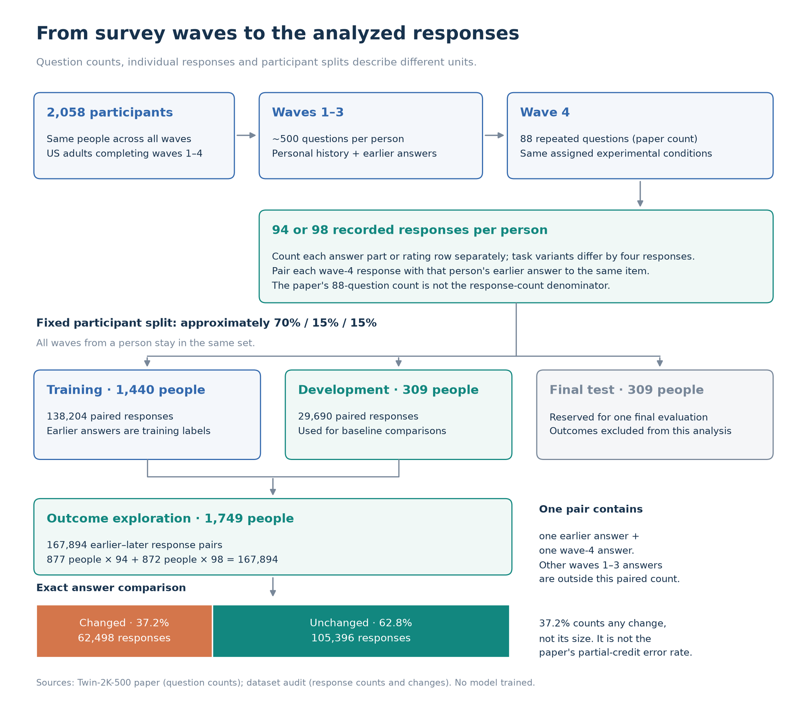
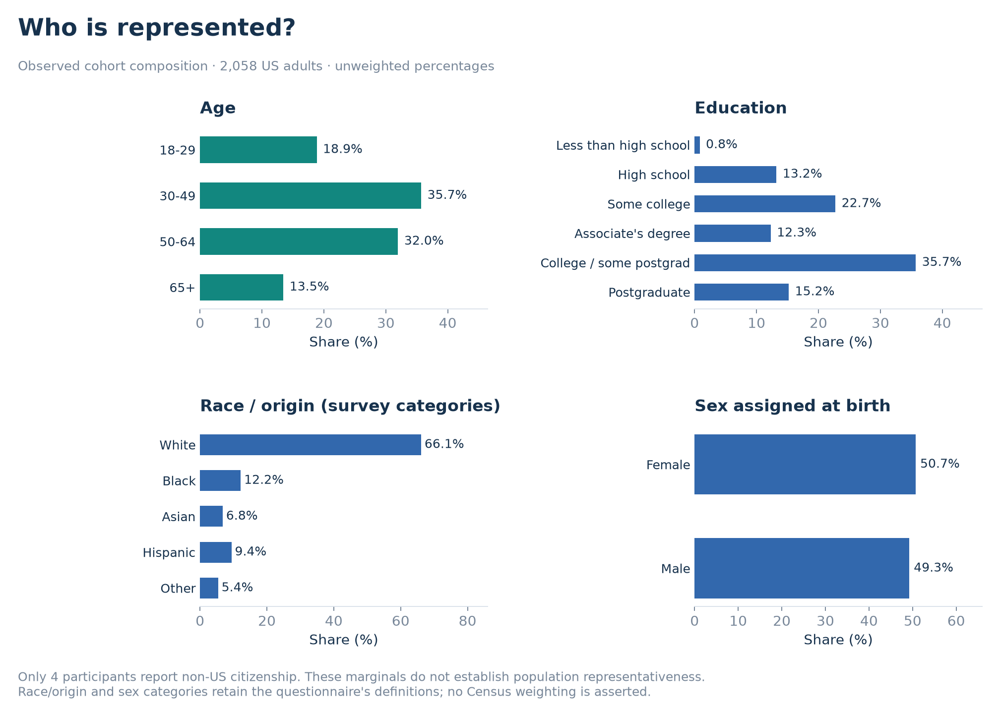
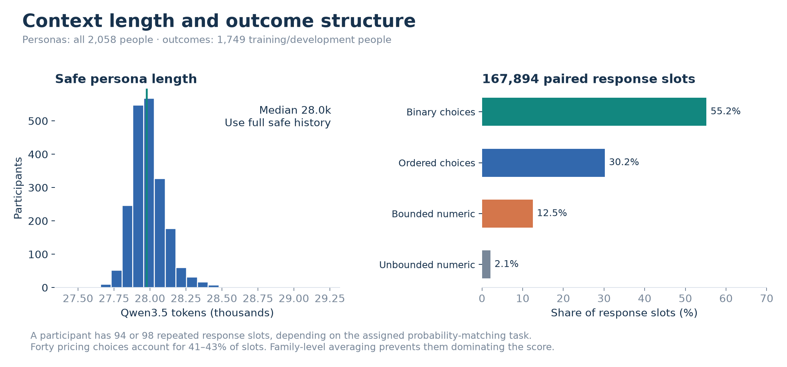
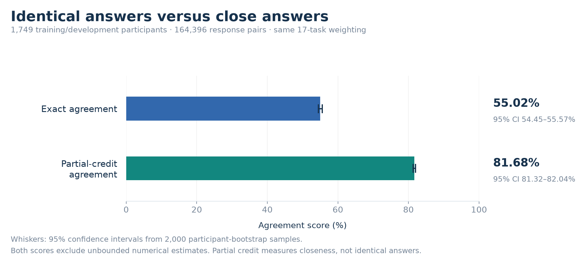
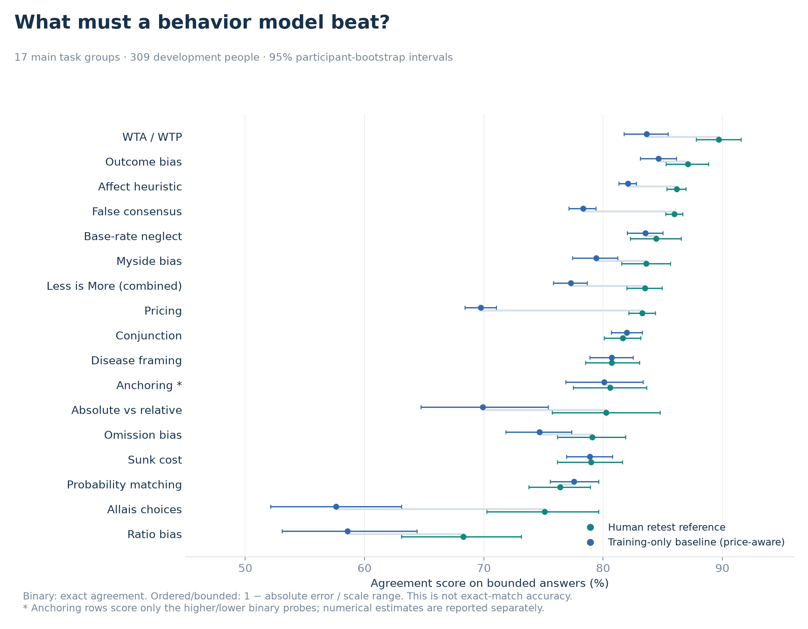
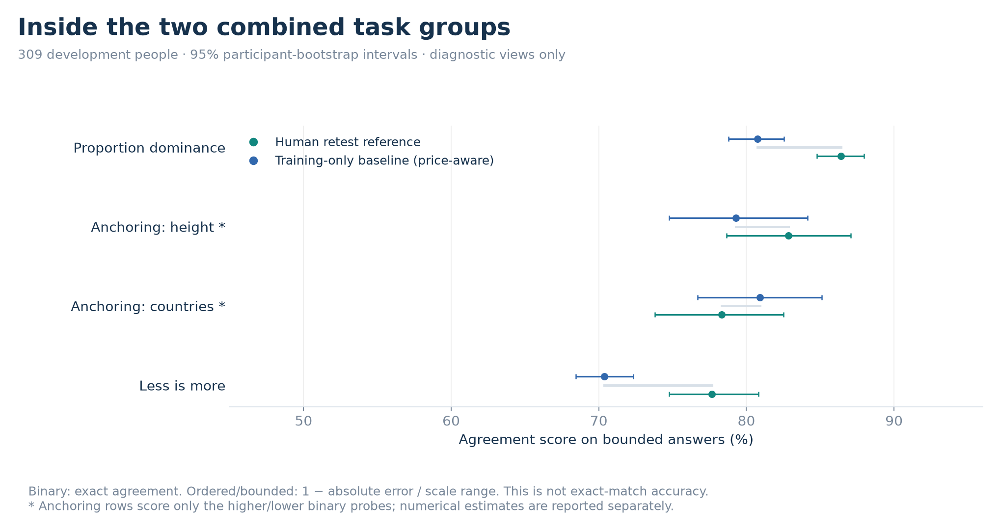
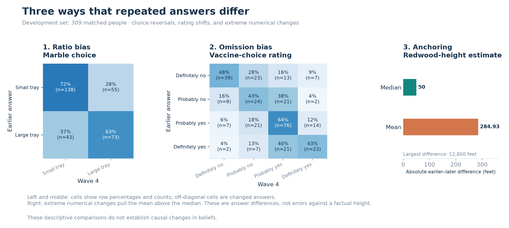
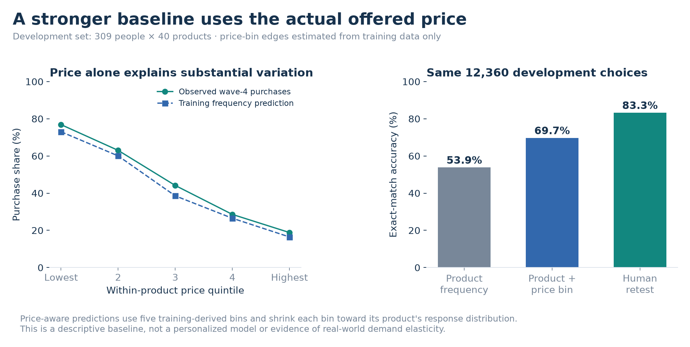

# 2. Data exploration

## 2.1 Main findings

This analysis identifies safe model inputs, describes who is represented, and establishes how difficult the prediction task is.

- **Dataset size:** 2,058 participants, roughly 500 questions across waves 1–3, and 88 repeated questions in wave 4.
- **Leakage risk:** The full-persona subset includes later answers. The model therefore uses the separate earlier-history subset.
- **Human consistency:** 55.02% exact agreement and 81.68% partial-credit agreement across 1,749 training/development participants, with equal task weights.
- **Price matters:** Including the offered price raises purchase-choice accuracy from 53.85% to 69.73% without personal information.
- **Full-history inputs:** A typical safe history is about **28,000 Qwen3.5 tokens**, within the model's 262,144-token context capacity. The full-history condition preserves all permitted history.
- **Limits:** This is a selected US survey cohort. Strong aggregate scores do not prove individual-level prediction or real-world business value.

## 2.2 Dataset overview

Source: [Twin-2K-500 on Hugging Face](https://huggingface.co/datasets/LLM-Digital-Twin/Twin-2K-500).

The figure distinguishes the paper's question count from the individual responses counted here. The 1,749 training/development participants contribute to outcome exploration and the leakage audit. Baseline comparisons use only the 309 development participants.

| Property | Dataset details |
| --- | --- |
| Participants | 2,058 unique US adults |
| Collection | Four survey waves |
| Waves 1–3 | Roughly 500 questions, including multi-part scales |
| Wave 4 | Repeats 88 earlier questions, as reported in the [source paper](https://arxiv.org/html/2505.17479v1#S2) |
| Six broad topics | Demographics, psychological traits, cognitive tasks, economic preferences, behavioral experiments, pricing |
| Answer formats | Multiple choice, ordered ratings, matrix questions, sliders, and text entries |
| Repeated outcomes | 94 or 98 responses per person across 17 main task groups. The difference reflects assigned task variants, not missing data. Each part of a multi-part question, such as a row in a rating table, is counted separately |
| Detailed views | Split Anchoring into countries/height and Less is More into gambling/proportion dominance, giving 19 diagnostic views |
| Outcome analysis | 167,894 earlier–later response pairs from 1,749 training/development people; repeated questions only |
| Final test | 309 participants reserved for evaluation after the method is finalized |

Each earlier–later pair links the same person's answers to a repeated question; the answers need not be identical. Other responses from waves 1–3 are not included in these pairs.

**Counting unit:** The released input history contains 170–172 question records per person, but one record can hold several answers. These records are not counted the same way as the paper's roughly 500 questions. Subtracting 88 from 500 therefore gives an approximation, not a verified count of 412 input records.

## 2.3 Input selection and leakage risk

| Subset | What it contains | Use here |
| --- | --- | --- |
| **Wave-split data** | Earlier history, earlier repeated answers, and wave-4 answers stored separately | Safe history supplies the input; repeated answers supply the labels |
| Full persona | Combined personal information that includes later answers | Leakage audit only; excluded from prediction input |

The dataset documentation states that the full persona uses wave-4 answers for repeated questions. This is intentional, but makes it unsuitable for predicting those same answers. [Dataset documentation](https://huggingface.co/datasets/LLM-Digital-Twin/Twin-2K-500#1-full-persona-folder).

The complete training/development audit confirms this:

- **Coverage:** All 1,749 training/development participants and their 167,894 repeated responses. The 309 final-test participants were excluded.
- **Changed answers:** 62,498 of 167,894 responses (37.2%) differed between the earlier waves and wave 4. In every case, the full persona contained the wave-4 answer, not the earlier answer.
- **Unchanged answers:** The remaining 105,396 responses matched both occasions. These alone cannot identify which version the full persona uses.
- **Completeness:** No missing participants, missing or invalid responses, question mismatches, or disagreements with wave 4 were found.

A model given the full persona could copy the answer it is supposed to predict. Summaries or embeddings made from it would inherit this leakage risk.

## 2.4 Participant characteristics

- **Sex at birth:** Categories are nearly balanced: **50.7% female and 49.3% male**.
- **Age:** Ages **30–64 account for 67.7%** of participants.
- **Education:** College/some-postgraduate and postgraduate categories together account for **50.9%**.
- **Citizenship:** Only four participants report non-US citizenship.
- **Representativeness:** These distributions do not establish population coverage. No population reweighting was applied.

The source study reports 2,509 first-wave completers and 2,058 all-wave completers, or about **18% attrition**. Recruitment quotas help coverage, but completion selection and self-report bias remain. [Source study](https://arxiv.org/pdf/2505.17479).

## 2.5 Input length and response formats

- **Typical length:** Median safe-history length: **27,975.5 tokens**, measured with the tokenizer from **Qwen/Qwen3.5-0.8B**.
- **Variation:** Middle 50%: approximately **27,910–28,051 tokens**. Maximum: **29,228**.
- **Implication:** The questionnaire creates consistently long histories. Cutting every input at the same position could systematically remove later topics.
- **Method choice:** The full-history condition preserves all permitted input. The retrieval conditions select a smaller set of evidence.

**Tokenizer choice:** Token counts depend on the model. Since the model is Qwen3.5-0.8B, its own tokenizer is the relevant measurement. Its native context capacity is **262,144 tokens**. The counts above describe the dataset's safe-history text; the structured model prompt also includes question details, instructions, and the target question. [Model configuration](https://huggingface.co/Qwen/Qwen3.5-0.8B/blob/main/config.json).

## 2.6 Human response consistency

This descriptive analysis uses all **1,749 training/development participants**. It compares people's earlier and later answers without fitting a predictive model. The 309 final-test participants remain excluded.

Both scoring rules use the same **164,396 binary, ordered, and bounded numeric response pairs**. Scores are averaged within each person and task, then across people, then equally across the 17 main tasks. The 3,498 unbounded numerical estimates are excluded from both composite scores.

- **Scoring rules:** Exact match asks whether the answers are identical. Partial credit also considers the size of a difference. Moving from 3 to 4 on a five-point scale counts as changed but earns 75% agreement.
- **Disagreement:** The complements are 44.98% weighted exact disagreement and 18.32% average normalized disagreement. The second measures how far answers differ, not the percentage of changed answers.
- **Confidence intervals:** Participants are resampled with replacement 2,000 times, keeping each person's answers together. The 2.5th and 97.5th percentiles of the recalculated scores form the 95% interval. This describes uncertainty in the average, not the spread of individual scores.
- **Counting and weighting:** The earlier **37.2% change rate** uses the same people but counts all 167,894 response pairs equally, including unbounded estimates. This figure uses bounded responses and equal task weights. For example, the 40 pricing choices receive only 1/17 of the headline weight.
- **Paper comparison:** The paper's **81.72%** also gives partial credit and averages across tasks. It does not mean that 81.72% of answers were identical. Its participant coverage and treatment of numerical anchoring differ from this analysis. [Paper scoring method](https://arxiv.org/html/2505.17479v1#S3).

## 2.7 Baselines and human reference

We compare simple prediction rules with people's own earlier answers. Every method is scored on the same **309 development participants** and **29,072 bounded response pairs**. Each task receives equal weight. The prediction rules use only training participants' earlier answers.

The **price-aware baseline** is a rule we built for this project. It uses how often training participants bought a product at similar prices. It does not use personal history. For other tasks, it predicts the most common answer or the median.

| Predictor | Partial-credit agreement | 95% interval |
| --- | ---: | ---: |
| Uniform random response, expected score | 58.62% | 58.43–58.82% |
| Most common answer or median | 75.45% | 74.65–76.21% |
| Same baseline with product-specific price information | **76.39%** | **75.60–77.15%** |
| The person's own earlier answer | **81.46%** | **80.66–82.26%** |

- **Participant scope:** Human agreement is **81.46%** here and 81.68% above. The earlier figure includes training and development participants. This comparison and the charts below use only development participants.
- **Scoring difference:** This analysis predicts the median for ordered ratings. [Chapter 04](04_evaluation.md#44-statistical-baselines) uses the most common answer, which explains its slightly different baseline scores.
- **Anchoring coverage:** Agreement covers only the higher/lower choices. Numerical estimates are reported separately.

**Findings**

- **Task variation:** Human consistency differs across tasks. A single headline score hides this variation.
- **Baseline gap:** The price-aware baseline is **5.07 percentage points** below human retest, with a paired interval of 4.20–5.95 points.
- **Human reference:** Human retest is a reference, not a strict upper bound. A model can sometimes predict a person's most likely answer more consistently than that person repeats it.
- **Interpretation:** Constant middle-of-scale predictions can receive high partial credit while missing individual differences.

### 2.7.1 Differences within combined task groups

Two main groups contain distinct sub-experiments and deserve a closer look. **Anchoring** tests whether an initial number influences estimates about countries or tree height. **Less is More** combines a gambling judgment with safety scenarios about absolute benefits and proportions. Their combined scores can conceal different patterns.

- **Anchoring:** Countries and tree height are shown separately. Their combined main group receives one headline weight.
- **Less is More:** The score averages one gambling response and two safety responses. It does not average the two subgroup means.
- **Other tasks:** The other 15 main groups are unchanged. Response types and aggregation are described in [Evaluation](04_evaluation.md#42-metrics-by-response-type).

### 2.7.2 Answer reversals, rating shifts, and extreme estimates

Three examples show why exact matching alone is not enough. Ratio bias is a binary choice between trays of marbles; omission bias asks for an ordered vaccine-choice rating; anchoring includes unrestricted numerical estimates. They illustrate different error types, not three additional benchmark groups.

- **Ratio bias:** 98 of 309 people change answers. Exact agreement is **68.28%**.
- **Omission bias:** Exact agreement is **52.43%**, but the partial-credit score is **79.07%**.
- **Unbounded estimates:** Redwood-height answers differ by a median of 50 feet, but mean absolute difference is 284.93 feet. Extreme answers strongly affect the mean.

These examples show why exact accuracy, partial-credit agreement, and numerical error describe different aspects of consistency.

## 2.8 Price information in purchase prediction

A model asked whether someone would buy a product needs both the product and its offered price. This comparison checks how much predictive performance comes from the offer itself before crediting personal-history modeling.

- **Coverage:** Each participant answers **40 pricing questions**, about 41–43% of their repeated response slots.
- **Product-only baseline:** On the same **12,360 development choices**, a product-only baseline scores **53.85%** exact accuracy.
- **Price information:** Adding training-derived price groups raises accuracy to **69.73%**. Human retest is **83.28%**.
- **Personalization control:** This gain requires no personal traits. It motivates the price-aware baseline in the model experiments.
- **Scope:** These are stated purchase choices, not observed purchases or a validated demand curve.

**Remaining questions**

- **New questions:** Can the model predict answers to question families it has not seen during training?
- **New populations:** Does performance hold for participants outside this US survey cohort?
- **Real decisions:** Do predictions of stated purchase choices translate into useful predictions of actual purchases?

**Previous: [← 1. Literature review](01_literature.md)**

**Next: [3. Model and experimental method →](03_method.md)**
