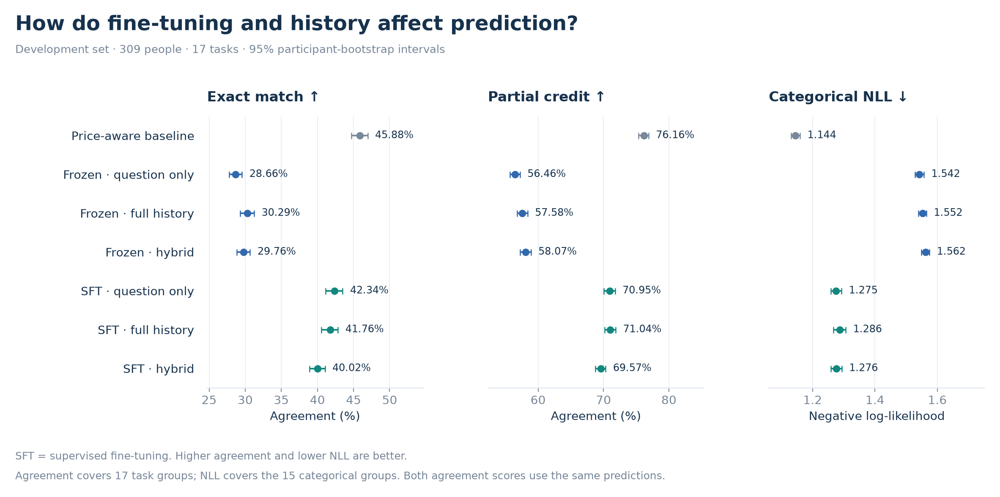
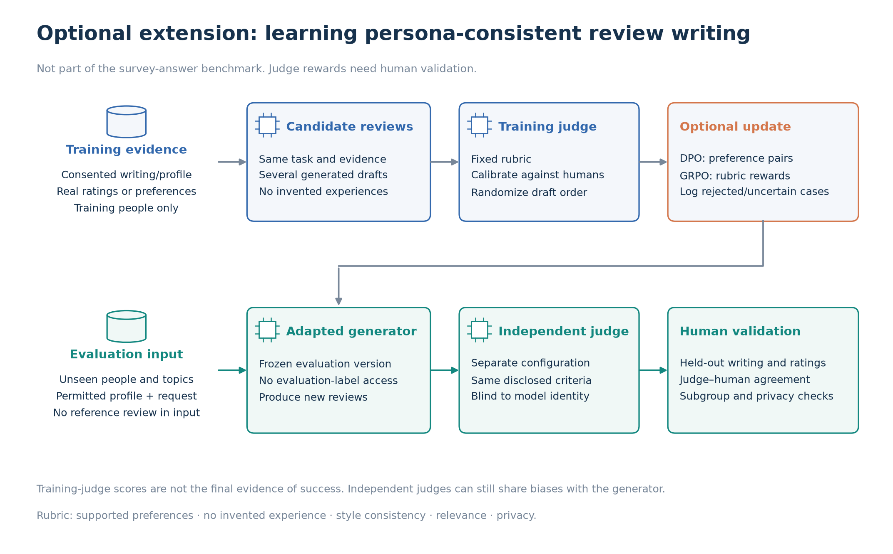

# 4. Evaluation

Evaluation addresses three questions: whether fine-tuning improves prediction, whether correct personal history adds value, and whether retrieval preserves quality with less input. Exact match measures identical answers. Partial credit also rewards nearby answers on ordered or bounded scales.

## 4.1 Metric definitions

| Metric | Meaning | Better direction |
| --- | --- | --- |
| Exact-match accuracy | Fraction of answers identical to the observed response | Higher |
| Partial-credit agreement | Closeness on a 0–1 scale, according to answer format | Higher |
| Negative log-likelihood (NLL) | Penalty for assigning low probability to the observed option | Lower |
| Multiclass Brier score | Squared probability error across all valid options | Lower |
| Absolute error | Numerical difference in the question's original units | Lower |
| Invalid-answer rate | Fraction of attempted outputs that fail format, range, or termination checks | Lower |

Let $`y`$ be the observed answer, $`\hat{y}`$ the prediction, and $`p_k`$ the probability of option $`k`$. The indicator $`\mathbb{1}`$ is 1 when its condition holds and 0 otherwise.

```math
\begin{aligned}
\mathrm{Exact}(y,\hat y) &= \mathbb{1}(\hat y=y),\\
\mathrm{NLL}(y,p) &= -\log p_y,\\
\mathrm{Brier}(y,p) &= \sum_{k=1}^{K}\left(p_k-\mathbb{1}(y=k)\right)^2,\\
\mathrm{AbsoluteError}(y,\hat y) &= \lvert\hat y-y\rvert.
\end{aligned}
```

For a valid answer on a stated range from $`L`$ to $`U`$, partial credit is:

```math
s(y,\hat y)=
\begin{cases}
\mathbb{1}(\hat y=y), & \text{binary or unordered choices},\\
1-\dfrac{\lvert\hat y-y\rvert}{U-L}, & \text{ordered scales or bounded numbers}.
\end{cases}
```

- **Example:** A prediction of 4 for an observed answer of 3 on a 1–5 scale receives zero exact credit and 0.75 partial credit: one minus the error of 1 divided by the range of 4.
- **Comparable predictions:** Both agreement metrics use the same predicted answer. Categorical predictions are the most likely valid label. Probabilities come from normalized label likelihoods.
- **Scale definition:** Ordered monetary options use rank steps, not dollar distances. Unordered categories receive no distance credit. Numerical bounds come from the questionnaire, not test outcomes.
- **Additional diagnostics:** Brier scores, invalid rates, and native-unit numerical errors accompany the main scores. ECE and reliability plots were not computed in this study.

## 4.2 Metrics by response type

The answer format determines the scoring rule. A task may contain several formats; each matrix row is scored separately. [Task definitions](https://arxiv.org/html/2505.17479v1#S2).

| Answer format | Observed → predicted | Exact credit | Partial credit or error |
| --- | --- | ---: | --- |
| Binary or unordered choice | Yes → No | 0 | 0 |
| Ordered rating, 1–5 | 3 → 4 | 0 | 0.75 |
| Bounded number, 0–100% | 60% → 70% | 0 | 0.90; absolute error of 10 percentage points |
| Unbounded number | 200 feet → 250 feet | Outside composite | Absolute error of 50 feet |

- **Agreement scope:** Exact and partial credit cover the same binary, ordered, and bounded numerical responses. They are identical for binary choices.
- **Probability scope:** NLL and Brier cover categorical responses, including ordered options. Free numerical estimates have no probability distribution under this prediction procedure.
- **Numerical scope:** Unbounded estimates are reported through mean and median absolute error. Errors with different units are not pooled.

**Difference from the paper:** For unbounded anchoring answers, Twin-2K converts values into ten ordered groups (deciles) based on wave-2 responses before calculating normalized distance and partial credit. This study does not apply that conversion: unbounded estimates are excluded from both agreement composites and reported in their original units. Anchoring's higher/lower choices still contribute to agreement. The scores therefore do not reproduce the paper's exact metric. [Paper, Section 3, footnote 5](https://arxiv.org/html/2505.17479v1#S3).

## 4.3 Final-score aggregation

Each of the **17 task groups receives equal weight**. This prevents the 40 pricing responses from dominating the result.

1. **Within a person and task:** Response scores are averaged.
2. **Within a task:** Participant scores are averaged.
3. **Across tasks:** Task means are averaged with equal weight.

```math
\begin{aligned}
S_{ig} &= \frac{1}{n_{ig}}\sum_{j=1}^{n_{ig}}s_{igj},\\
S_g &= \frac{1}{N_g}\sum_{i\in\mathcal I_g}S_{ig},\\
S_{\%} &= \frac{100}{G}\sum_{g=1}^{G}S_g.
\end{aligned}
```

Here, $`n_{ig}`$ counts responses for person $`i`$ in task $`g`$, and $`\mathcal I_g`$ contains its $`N_g`$ participants. Agreement uses $`G=17`$. NLL and Brier use the 15 categorical task groups.

- **Invalid outputs:** Failed answers receive zero agreement and remain in the denominator. The invalid-answer rate counts all attempted response rows equally. Numerical error summaries report valid and attempted counts. Missing categorical probabilities would make NLL incomplete.
- **Uncertainty:** The 95% intervals use 2,000 participant-bootstrap samples. All answers from a sampled person stay together. Paired differences use the same sampled people for both methods.
- **Repeated controls:** Shuffled-history and random-retrieval scores are averaged across three assignments within each person. The repeats do not count as additional participants.
- **Final selection:** The highest development partial credit selects among frozen and SFT question-only, full-history, and hybrid configurations. Selection uses unrounded means; exact ties retain that listed order. A single probability temperature is fitted by development NLL afterward. Calibration changes probabilities, not predicted answers. The revised choice is fixed before its new test evaluation, but the original test results were already known.

## 4.4 Statistical baselines

The baselines estimate how well simple rules work without personal history. Their answer frequencies, medians, and price groups come only from training participants' earlier responses.

| Baseline | Prediction rule | Purpose |
| --- | --- | --- |
| Uniform guessing | Equal option probabilities or a uniform bounded numerical draw | Exploratory reference in chapter 02 |
| Common answer / median | Most common categorical answer; median for numerical outputs | Tests whether a typical answer is sufficient |
| Price-aware | Product-specific buying rate adjusted for the offered price | Tests information in the offer itself |

The price-aware rule was developed for this project. It changes only purchase predictions; other tasks retain the common-answer/median rule. The original paper reports random guessing and human retest comparisons. [Paper comparisons](https://arxiv.org/html/2505.17479v1#S5.T2).

1. **Price groups:** Training prices are divided into up to five groups for each product using the 20th, 40th, 60th, and 80th percentiles. Repeated prices can reduce the number of groups.
2. **Buying rates:** The rate in a price group is blended with the product-wide rate. This stabilizes estimates from small groups.
3. **Prediction:** The offered price selects the group. A probability of at least 0.5 predicts “buy.”

If $`B`$ is the number of buyers and $`N`$ the number of responses, the smoothed probabilities are:

```math
\begin{aligned}
q &= \frac{B_{\mathrm{product}}+1}{N_{\mathrm{product}}+2},\\
p &= \frac{B_{\mathrm{group}}+5q}{N_{\mathrm{group}}+5}.
\end{aligned}
```

- **Smoothing:** The weight 5 adds five equivalent responses at the product-wide rate. Other categorical baselines add one to each option count before normalization, avoiding zero probabilities.
- **EDA difference:** Chapter 02 uses median predictions for ordered ratings. These experiments use the most common option for both agreement columns. Their difference therefore reflects scoring, not different predictions.
- **Human reference:** Human retest compares the person's earlier and later answers. It uses a previous target answer excluded from model input, so it is a reference rather than a strict upper bound.

## 4.5 Experiment results

E1–E3 compare personal history, fine-tuning, and retrieval on the same **309 development participants and 17 tasks**. These comparisons explain what helps. Development scores then select one eligible Qwen configuration for test evaluation.

Each adapter completed **128 optimizer updates**, with an effective batch of 32 examples (4,096 examples in total). NLL covers the 15 categorical task groups.

**Reading the tables:** **Bold** marks the best score and <ins>underline</ins> the second-best for exact match, partial credit, and NLL. Ties at the displayed precision share a rank. Human retest is an unranked reference. Highlighting shows numerical rank, not a statistically established difference.

**Selection revision:** Partial credit replaces NLL for checkpoint and configuration selection. Both adapters peak at update 64 (2,048 examples seen). The original training completed 128 updates. Because the original test results had already been examined, the revised test is retrospective.

### 4.5.1 E1: Personalization

**Question:** Does the correct person's history help beyond absent, demographic, or shuffled histories?

| Condition | Exact % ↑ | Partial credit % ↑ | NLL ↓ | Invalid % ↓ |
| --- | ---: | ---: | ---: | ---: |
| Common answer / median | <ins>44.94</ins> | <ins>75.23</ins> | <ins>1.151</ins> | 0.00 |
| Price-aware baseline | **45.88** | **76.16** | **1.144** | 0.00 |
| Human retest | 54.92 | 81.46 | — | 0.00 |
| Frozen / question only | 28.66 | 56.46 | 1.542 | 0.00 |
| Frozen / demographics | 29.78 | 57.68 | 1.580 | 0.00 |
| Frozen / full history | 30.29 | 57.58 | 1.552 | 8.69 |
| Frozen / shuffled history | 30.40 | 57.72 | 1.552 | 8.69 |
| SFT / full history | 41.76 | 71.04 | 1.286 | 0.00 |
| SFT / shuffled history | 41.88 | 71.03 | 1.287 | 0.00 |

**Findings**

- **Answer:** A reliable personalization benefit is not established. Correct and shuffled histories have similar partial credit, both before and after SFT. The small differences could reflect sampling variation.
- **Interpretation:** The demographic comparison does not establish better partial credit for full history.
- **Limit:** Shuffled histories average three donor assignments. Donors are not matched on demographics. Human retest has access to earlier target answers that the models do not receive.

### 4.5.2 E2: Fine-tuning

**Question:** Does SFT improve prediction, and does history add value beyond learning common answers?

| Condition | Exact % ↑ | Partial credit % ↑ | NLL ↓ | Invalid % ↓ |
| --- | ---: | ---: | ---: | ---: |
| Price-aware baseline | **45.88** | **76.16** | **1.144** | 0.00 |
| Frozen / question only | 28.66 | 56.46 | 1.542 | 0.00 |
| Frozen / full history | 30.29 | 57.58 | 1.552 | 8.69 |
| SFT / question only | <ins>42.34</ins> | 70.95 | <ins>1.275</ins> | 0.00 |
| SFT / full history | 41.76 | <ins>71.04</ins> | 1.286 | 0.00 |

**Findings**

- **Answer:** Yes. SFT raises partial credit by 14.49 percentage points with question-only input and 13.46 points with full history. Both gains are supported by paired comparisons.
- **Value of history:** Full-history and question-only SFT have similar partial credit; the paired interval includes zero. The numerical ranking does not establish a personalization benefit.
- **Baseline comparison:** Full-history SFT remains below the price-aware baseline on development partial credit. The original, secondary target of at least 2% lower NLL with a paired interval below zero is not met.

### 4.5.3 E3: Retrieval

**Question:** Can selected evidence preserve quality with less input, beyond random shortening?

**Frozen-model comparison**

| Condition | Exact % ↑ | Partial credit % ↑ | NLL ↓ | Invalid % ↓ |
| --- | ---: | ---: | ---: | ---: |
| Frozen / full history | **30.29** | 57.58 | **1.552** | 8.69 |
| Frozen / random retrieval | <ins>29.92</ins> | <ins>58.76</ins> | 1.564 | 0.01 |
| Frozen / BM25 | 29.90 | **59.83** | <ins>1.558</ins> | 0.00 |
| Frozen / semantic | 29.81 | 58.17 | 1.568 | 0.00 |
| Frozen / hybrid | 29.76 | 58.07 | 1.562 | 0.00 |

**Same SFT adapter, different inputs**

| Condition | Exact % ↑ | Partial credit % ↑ | NLL ↓ | Invalid % ↓ |
| --- | ---: | ---: | ---: | ---: |
| SFT / full history | **41.76** | **71.04** | <ins>1.286</ins> | 0.00 |
| SFT / hybrid | <ins>40.02</ins> | <ins>69.57</ins> | **1.276** | 0.00 |

**Findings**

- **Answer:** Hybrid retrieval reduces mean input length by 89.0%. For SFT, it reduces partial credit relative to full history. The SFT partial-credit difference is -1.47 percentage points.
- **Retriever choice:** BM25 has the lowest NLL and highest partial-credit point estimates among the three retrievers. Paired partial-credit comparisons favor BM25 and length-matched random retrieval over hybrid. Hybrid and semantic retrieval do not differ clearly.
- **Limit:** The study tests one retrieval size and encoder. The SFT adapter was trained on full history, so these results do not establish how an adapter trained specifically for retrieved input would perform.

**Random-control check:** Item counts match hybrid retrieval. Token lengths are within 2% in 99.9% of draws; the largest mismatch is 3.2%.

### 4.5.4 From development results to the final test

The experiments compare input and training choices. Selection uses development scores only; test results do not enter the ranking.

1. **Eligible models:** Six Qwen configurations enter selection: frozen and SFT models, each with question-only, full-history, or hybrid input. Demographics, shuffled histories, random retrieval, BM25, and semantic retrieval serve as controls. Statistical baselines remain separate references.
2. **Selection:** The highest development partial credit selects **SFT / full history** (71.04%). Scores use unrounded means; exact ties retain the listed candidate order. This numerical choice does not prove superiority over every alternative.
3. **Final test:** A probability temperature of **1.778** is fitted on development data. Temperature is fitted by NLL to improve probabilities; it does not change predicted answers or partial credit. The revised choice is fixed before this new evaluation on the same 309 test participants. Their original test results were already known.

**Decision:** The selected Qwen model still has lower development partial credit than the price-aware baseline. It is the best eligible Qwen configuration by the selection rule, not the best predictor overall.



**Evidence behind the findings:** Paired comparisons score the same people under both conditions. A 95% interval containing zero does not establish a difference. Intervals are exploratory and are not adjusted for multiple comparisons. The complete [paired comparisons](../results/paired_comparisons.csv) and [score intervals](../results/model_scores.csv) remain available for inspection.

### 4.5.5 Retrospective test result

**Question:** Does the selected Qwen configuration outperform the statistical baselines on new participants?

| Method | Exact % ↑ | Partial credit % ↑ | NLL ↓ |
| --- | ---: | ---: | ---: |
| Common answer / median | <ins>46.54</ins> | <ins>76.33</ins> | <ins>1.150</ins> |
| Price-aware baseline | **47.46** | **77.24** | **1.143** |
| Human retest | 55.18 | 81.56 | — |
| Selected model, uncalibrated | 43.22 | 72.49 | 1.300 |
| Selected model, calibrated | 43.22 | 72.49 | 1.238 |

**Findings**

- **Answer:** No. The price-aware baseline has better observed exact match, partial credit, and NLL. The selected Qwen model has not surpassed this simple reference under the available training budget.
- **Calibration:** Temperature scaling changes NLL from 1.300 to 1.238 without changing the predicted answers. Exact match and partial credit therefore remain unchanged. The selected model has 0.00% invalid responses.

**Uncertainty:** The calibrated model's 95% intervals are 42.11–44.34% for exact match, 71.73–73.28% for partial credit, and 1.226–1.249 for NLL. These bootstrap intervals can be asymmetric, so they are retained as ranges rather than a symmetric ± margin. Full intervals are in [model scores](../results/model_scores.csv).

[Task scores](../results/task_scores.csv) cover all 17 groups. [Numerical errors](../results/numeric_errors.csv) retain the original units.

### 4.5.6 Quality and compute

These times cover the full development set with frozen Qwen. Random-control times average three runs. **Total time includes model inference, history selection, and question embedding.** The last two columns break down that total; they are not extra costs.

| Input | Mean input tokens | Total time (min) | History selection (min) | Question embedding (min) |
| --- | ---: | ---: | ---: | ---: |
| full history | 31,560 | 55.23 | 0.00 | 0.00 |
| random retrieval | 3,453 | 58.70 | 14.93 | 1.49 |
| BM25 | 4,060 | 54.41 | 9.86 | 0.00 |
| semantic | 2,756 | 48.57 | 9.88 | 1.49 |
| hybrid | 3,466 | 53.86 | 9.91 | 1.49 |

- **History selection:** Time spent selecting and assembling the history items, including cache reads and token-length matching for random inputs.
- **Question embedding:** Time spent converting target questions into vectors for semantic matching. Cached encoding costs are included. BM25 does not require question embeddings.

**Finding:** Hybrid retrieval cuts input length by 89.0%, but total time changes only from 55.23 to 53.86 minutes. Prefix caching reduces repeated full-history computation, while retrieval adds selection and embedding work.

**Timing scope:** Warmup, model loading, and one-time history embedding are excluded from this table. These are measurements of this implementation, not general hardware benchmarks. [Compute records](../results/compute.csv) retain the separate history-embedding cost.

### 4.5.7 Limits and next experiments

- **Training budget:** Each adapter processed 4,096 examples. The completed run is one pass through the selected subset, not an epoch over all 90,720 available examples. Partial credit peaks at update 64, while NLL continues to improve through update 128. The metrics favor different checkpoints; more training does not guarantee better agreement.
- **Further training:** A follow-up could use more examples and stop after a predefined number of development checks without improvement. The best checkpoint would be retained. Numerical divergence would indicate a training failure, not a desired stopping point.
- **Larger models:** More capacity may help, but this was not tested. Any gains would need to justify the additional memory, latency, and cost.
- **Generalization:** One model size and one training seed limit the conclusions. The three control seeds vary history assignments, not model training. Further tuning requires a fresh final test, and aggregate scores do not establish individual fidelity.

## 4.6 LLM judges for open-ended responses

Multiple-choice answers can be scored directly against human responses. Open-ended writing requires a different evaluation because several texts may be acceptable. The following is a proposed extension, not part of the completed experiments.



1. **Rubric:** Consented writing samples and participant ratings would define supported preferences, style, relevance, and invented experiences.
2. **Judge validation:** Blinded human ratings would check the judge's agreement and sensitivity to answer order or length.
3. **Training feedback:** DPO or GRPO would require reliable preference pairs or rewards. Uncertain judgments would be excluded.
4. **Independent evaluation:** Unseen people and topics, a separate judge, and held-out human ratings would test generalization.

A separate judge may still share the training judge's biases. Human validation remains necessary. Twin-2K results alone do not demonstrate review-writing ability. [LLM-as-a-judge study](https://arxiv.org/abs/2306.05685).

**Previous: [← 3. Model and experimental method](03_method.md)**

**Next: [5. Applications, guardrails, and maintenance →](05_applications.md)**
