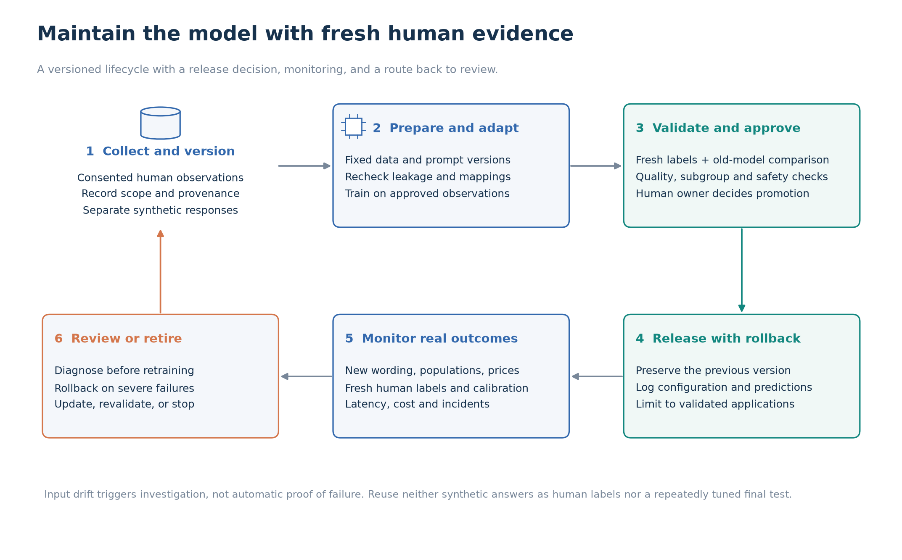

# 5. Applications, guardrails, and maintenance

Behavior models could support teaching, software testing, and research planning. This study did not establish a reliable personalization benefit, so these applications remain proposals requiring separate validation. **Simulated answers are not observations of real people.**

## 5.1 Survey applications and limitations

These are real human-survey studies. The model uses below are proposals, not claims that these organizations use this model.

1. **Teaching and software testing — can be fully synthetic:** Twin-2K studies repeated behavioral choices, ratings, and product offers. Students could use fictional respondents to practice scoring or test a survey interface. This cannot establish a real behavioral effect. For basic software checks, fixed test examples may be cheaper and more reliable than a model. [Twin-2K study](https://arxiv.org/html/2505.17479v1#S2).
2. **Questionnaire design — use with human checks:** Pew surveyed 5,410 US adults about AI in August 2024. A survey team could use a model to suggest possible interpretations of draft questions, then check them in interviews with real respondents. Generated answers must not replace public-opinion estimates. [Pew methods](https://www.pewresearch.org/internet/2025/04/03/us-public-and-ai-experts-methodology/).
3. **Retail concept selection — use with human checks:** The ACSI Retail and Consumer Shipping Study 2025 used 41,850 completed surveys. Retail teams could test whether simulations help shortlist concepts for a customer study. Relevant customer data and real customer validation are still required; Twin-2K purchase choices do not demonstrate actual satisfaction or sales. [ACSI study](https://theacsi.com/news-and-resources/press-releases/2025/01/28/press-release-retail-and-consumer-shipping-study-2025/).
4. **Patient experience — cannot replace human reports:** NHS England's GP Patient Survey measures patients' experiences of care. Synthetic examples could test its software, but a model trained on US survey respondents cannot establish UK patients' experiences or replace official results. [Survey description](https://www.england.nhs.uk/statistics/statistical-work-areas/patient-surveys/gp-patient-survey/).

## 5.2 Retail concept shortlisting

A prospective retail study would compare model-assisted shortlisting with the team's existing process:

1. **Study design:** Concepts, prices, target customers, and human evaluation are specified before rankings are generated.
2. **Shortlisting:** Both selected and rejected concepts are retained.
3. **Customer checks:** A random sample of rejected concepts is tested alongside selected concepts to identify useful ideas the model missed.
4. **Evaluation:** Outcomes include ranking agreement, promising concepts missed, subgroup errors, researcher time, and total cost.

Success means improving the research process. Stated purchase choices alone do not establish actual demand or the causal effect of a price change.

## 5.3 Risk levels and guardrails

The levels below are **qualitative judgments of potential harm before controls**, not measured probabilities:

- **Low:** Contained testing or teaching with fictional people and no claims about real populations.
- **Medium:** Research-design mistakes that can be checked before decisions.
- **High:** Misleading claims about people, privacy loss, or unfair representation.
- **Critical:** Consequential decisions about individuals or targeted manipulation; excluded from this project's uses.

| Risk | Level | Required control |
| --- | --- | --- |
| Generated answers presented as real observations | High | Label simulations and store them separately. Never invent interview quotations or testimonials |
| Personal histories exposed | High | Check consent, remove unnecessary identifiers, restrict access, and define deletion rules. Do not send profiles to outside services without authorization |
| Stereotypes mistaken for personal preferences | High | Compare correct, absent, and shuffled histories; inspect subgroup errors and unsupported claims |
| Simulations miss useful questions or concepts | Medium | Test with real respondents, including ideas rejected by the model |
| Questionnaire text redirects the model | High | Treat histories as data, not instructions. Validate outputs and preserve question conditions and prices |
| Predictions applied to a new population | High | Validate with relevant people before use; do not assume transfer across countries, brands, or services |
| Individual credit, hiring, insurance, or clinical decisions; vulnerability targeting or impersonation | Critical | Prohibit these uses; a survey simulation is not evidence for such decisions |
| A judge rewards convincing but inaccurate reviews | High | Keep independent human evaluation and inspect highly scored examples for invented details |

A low-risk software test does not make real participant profiles safe to expose. Apply privacy controls whenever real histories are involved.

## 5.4 Maintenance lifecycle

1. **Collect and version:** Record data provenance, consent scope, questionnaires, model/tokenizer, prompt, input-selection policy, and environment. Separate real and synthetic data.
2. **Prepare and adapt:** Repeat leakage and answer-mapping checks; train only on approved observations. Never treat generated answers as newly observed human behavior.
3. **Validate and approve:** Compare with the previous model and simple baselines on fresh human labels. Check calibration, subgroup errors, privacy, latency, and failures; a human owner decides whether to release.
4. **Release with rollback:** Preserve the previous model and configuration, and log the input-selection and prediction settings.
5. **Monitor real outcomes:** Changed wording, prices, or population mix can trigger review. They do not by themselves prove that predictions have degraded; obtain fresh human labels to check.
6. **Review or retire:** Diagnose persistent deterioration before retraining. Roll back on severe failures; otherwise update with new observations, revalidate on a fresh later set, or retire the model. Do not repeatedly tune against the original final test.

Track exact accuracy, partial-credit agreement, NLL/calibration where applicable, subgroup errors, valid-answer latency, and cost. Set alert thresholds around the application's risks and observed variability, not an arbitrary universal percentage.

**Previous: [← 4. Evaluation](04_evaluation.md)**

**Next: [6. Reproducibility →](06_reproducibility.md)**
