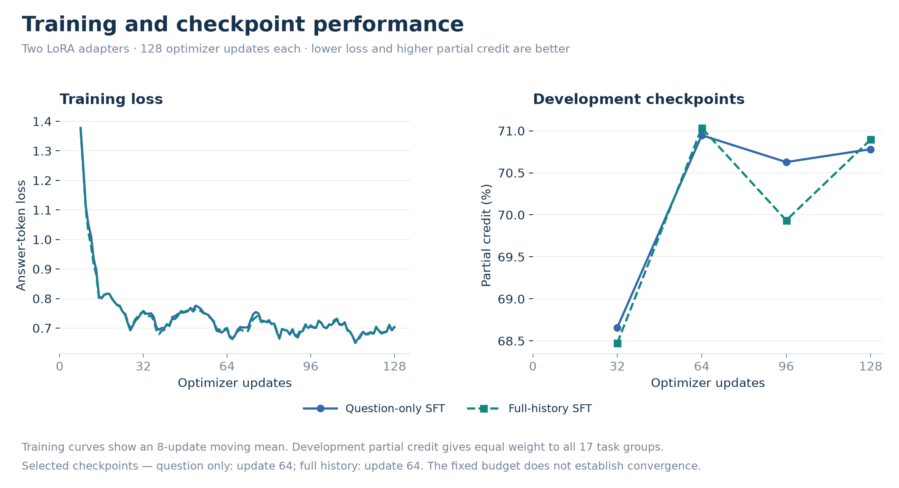

# 6. Reproducibility

## 6.1 Study scope

The original study completed two LoRA training runs, all E1–E3 controls, and a reserved-test evaluation. The completed partial-credit revision reused those runs and evaluated the update-64 controls and newly selected test configuration without retraining. The submission contains the report, figures, aggregate results, configuration, source code, and tests. Raw participant records and model checkpoints remain in local storage.

## 6.2 Analysis and input preparation

- **Environment:** The run used Python 3.12 and one RTX 5080 with 16 GB VRAM. The commands below use `uv` and run from the project root.
- **Pinned inputs:** Dataset, model, and embedding revisions are fixed in `configs/model_plan.json`. The requirements files specify package versions.
- **Sources:** Inputs come from [Twin-2K-500](https://huggingface.co/datasets/LLM-Digital-Twin/Twin-2K-500), [Qwen3.5-0.8B](https://huggingface.co/Qwen/Qwen3.5-0.8B), and [Qwen3-Embedding-0.6B](https://huggingface.co/Qwen/Qwen3-Embedding-0.6B).

```bash
uv venv --python 3.12 .venv
uv pip install --python .venv/bin/python -r requirements-training.txt
export PYTHONPATH="$PWD/src"
export TOKENIZERS_PARALLELISM=false
export PYTORCH_ALLOC_CONF=expandable_segments:True

.venv/bin/python -m twinlab.download
.venv/bin/python -m twinlab.analyze
.venv/bin/python -m twinlab.figures
.venv/bin/python -m pytest -q
```

The EDA excludes reserved-test outcomes. Intermediate data are written under `data/`, which is excluded from the submission.

## 6.3 Input variants

| Experiment | Comparisons |
| --- | --- |
| E1: Personalization | Absent, demographic, correct, and shuffled histories |
| E2: Fine-tuning | Question-only and full-history adapters, with frozen controls |
| E3: Retrieval | Full history, random, BM25, semantic, and hybrid evidence |

- **Retrieval:** Selected inputs contain 16 non-demographic items plus demographics. Hybrid RRF uses equal weights and constant 60.
- **Assignment seeds:** Random and shuffled controls use seeds 42, 43, and 44. These are assignment repeats, not independent training runs.
- **Input limits:** Full history is preserved without truncation. The model's native context limit remains the only sequence cap.

## 6.4 Training settings and commands

Each adapter completed **128 optimizer steps × 32 examples = 4,096 person–question examples**. An optimizer step updates the weights after accumulating gradients from the effective batch. An epoch is one pass through the chosen training dataset.

The saved schedule contains 4,096 distinct examples, each processed once: **one pass through that subset**, or **4.51% of a full-data epoch**. It covers all 1,440 training participants and 17 tasks, with 9,406 response rows. The full pool contains 90,720 questions and 138,204 response rows.

| Setting | Value |
| --- | --- |
| Model / objective | Qwen3.5-0.8B; answer-only cross-entropy; thinking off |
| Precision | CUDA bfloat16; no weight quantization |
| LoRA | Language-layer linear modules; rank 8, alpha 16, dropout 0.05 |
| Optimizer | AdamW; learning rate `1e-4`, weight decay 0.01 |
| Budget | 128 optimizer steps; effective batch 32; seed 42 |
| Schedule | 5% warmup; linear decay; gradient clipping 1.0 |
| Checkpoints | Updates 32, 64, 96, and 128; highest development partial credit selected |

- **Sampling and loss:** The schedule balances participants and tasks. Each question's loss averages its response losses. Prompt and padding tokens contribute no loss.
- **Physical batches:** Both runs use gradient checkpointing. Question-only training changes from one example per microbatch to 32 after update 32. Full-history training keeps one example per microbatch with 32 accumulation steps. The effective batch remains 32.
- **Runtime reproducibility:** `configs/runtime_profile.json` records the update-dependent changes. Bfloat16 rounding and dropout draws can depend on batching, so exact numerical replay is not guaranteed across environments.

The following command reproduces the original NLL-selected run. It resumes matching saved settings. The configuration now defaults to partial credit, so the historical rule is explicit here.

```bash
.venv/bin/python -m twinlab.run_experiment \
  --name main-study --scope full --max-updates 128 --eval-every 32 --selection-metric nll \
  --runtime-profile configs/runtime_profile.json \
  --defer-checkpoint-evaluation
```

- **Evaluation order:** Both adapters finish training before checkpoint selection. Development uses all 309 participants and 19,467 questions.
- **Original test:** The initial 309-person test was opened after the original NLL selection and calibration were fixed. The revised test reuses these participants and is retrospective.
- **Completion:** A successful run audits the saved scores, writes final tables and figures, and creates `dist/submission.zip`. Incomplete runs cannot produce a final archive.

The revision command below changes checkpoint and configuration selection to partial credit. It copies completed development evidence, evaluates hybrid input and three shuffled-history controls with the saved full-history update-64 adapter, then tests the winning eligible configuration. It never calls training.

```bash
.venv/bin/python -m twinlab.reselect_experiment \
  --source main-study --name partial-credit-study
```

- **Saved evidence:** Original predictions, checkpoint scores, and adapter hashes remain intact. Revised outputs are stored separately. Interrupted evaluations resume from complete prediction records.
- **Checkpoint availability:** The original run retained question-only update-64 predictions but overwrote its weights. Its development score is below the available full-history update-64 checkpoint, so it cannot win selection. No weights are reconstructed and no training is repeated.
- **Reporting:** The revision writes results locally. The audit and publication commands below regenerate the submission after evaluation completes.

## 6.5 Completed run

| Adapter | Updates | Selected | Samples | Processed tokens | Training hours | Peak GiB |
| --- | ---: | ---: | ---: | ---: | ---: | ---: |
| question only | 128 | 64 | 4,096 | 996,763 | 0.546 | 4.64 |
| full history | 128 | 64 | 4,096 | 129,235,677 | 7.133 | 9.07 |

- **Timing scope:** Training times exclude evaluation and setup. CPU throttling affected training and was corrected during evaluation. These times are not normal-speed hardware benchmarks.
- **Learning progress:** Both adapters peak on development partial credit at update 64, while NLL reaches its lowest value at update 128. The selected update-64 checkpoints have seen 2,048 examples each (2.26% of the full pool), covering all 1,440 people and 17 tasks. The fixed budget does not establish convergence. [Training curves](../results/training_curves.csv) retain every update and checkpoint value.



## 6.6 Evaluation and run records

- **Prediction:** Categorical outputs use normalized valid-label probabilities. Numerical outputs use greedy decoding. Earlier human answers to the target question remain hidden.
- **Caching:** Independent questions receive copies of the same history-prefix state. Identical question-only prompts can reuse predictions within one checkpoint. Each participant is still scored separately.
- **Timing:** Each evaluation invocation receives a warmup. Reported costs include prediction, query encoding, and retrieval. History embedding is recorded separately. Host settings and resume boundaries accompany the measurements.

| Location | Purpose |
| --- | --- |
| `configs/`, `splits/` | Pinned settings and participant assignments |
| `src/twinlab/`, `tests/` | Data preparation, analysis, figures, training, scoring, and validation |
| `docs/04_evaluation.md`, `results/` | Findings and final aggregate tables |
| `checkpoints/main-study/` | Original adapters, predictions, audits, and runtime records |
| `checkpoints/partial-credit-study/` | Revised selection, new predictions, and source-file hashes |

These commands check and publish an already completed run. They read saved predictions and do not run model inference or training.

```bash
# Verify training coverage and saved scores, including the completed test.
.venv/bin/python -m twinlab.audit_run checkpoints/partial-credit-study --include-test

# Rebuild final results, numbered sections, figures, and submission archive.
.venv/bin/python -m twinlab.finalize_submission checkpoints/partial-credit-study
```

- **Audit coverage:** Checks compare saved scores with source answers, verify the training sample schedule, and confirm full participant/task coverage. Publication also checks local Markdown links and section anchors.
- **Optional GPU checks:** `validate_runtime`, `benchmark_runtime`, and `benchmark_inference` support correctness and throughput checks on training/development data. They are separate from report regeneration.
- **Archive contents:** The archive excludes source data, checkpoints, credentials, private logs, and operational repair scripts. `runtime_environment` only reads host settings.

**Previous: [← 5. Applications, guardrails, and maintenance](05_applications.md)**

**Return to the [report overview →](../README.md)**
